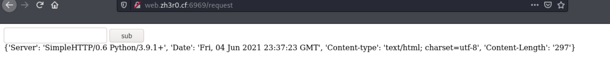
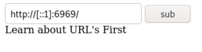
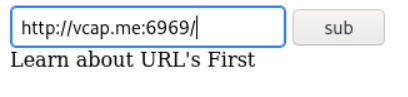
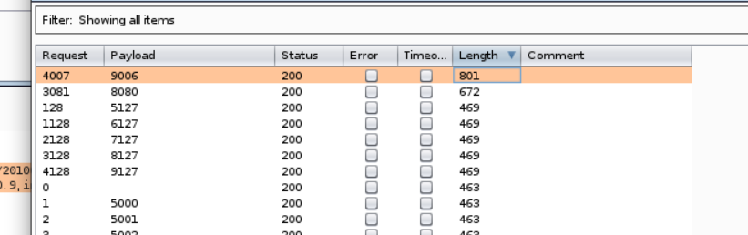
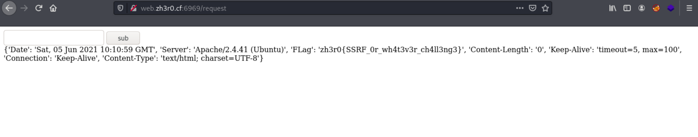
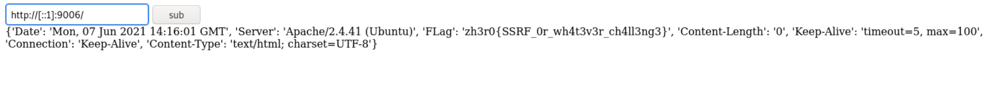

# Baby SSRF - Zh3r0 CTF V2 [40 solves] [453 points]
## Description
```
Yet another server challenge :)
⬇️ link - ssrf_link
Author - ZyperX
```
~~[http://web.zh3r0.cf:6969/](http://web.zh3r0.cf:6969/)~~

[http://web.zh3r0.cf:1111/](http://web.zh3r0.cf:1111/)

---
## Hint
```
for i in range(5000,10000)
xD
```
---
## Solution

In the **/request** page, there is a textbox where we can just enter an URL and send a POST request to the server, and the server will make a GET request to that URL we entered. 

I tried to start a python HTTP server and send a POST request of the URL of my server to the server. 

Here is the result :



If the URL entered is valid, the server will show us the HTTP response header of the URL entered in JSON format.

If it's not valid, it will show **"Learn about URL's First"**, and if the URL include "127" or "localhost", there will have some filter preventing the server making a GET request to localhost, and will show **"Please dont try to heck me sir..."** instead.

The hint shows that there might be a port opening internally within that range. So we can to do SSRF to find out which port is open and see what we can get from those open ports, but we can't use "localhost" or "127.x.x.x" on the URL.

So we need to bypass the filter to reach localhost without using "localhost" or "127.x.x.x".

First I tried to use the IPv6 loopback address to bypass the filter for the URL :
```
http://[::1]:6969/
```
I expect it will response with the HTTP response header of the server itself because it is running on port 6969, but it response with **"Learn about URL's First"** instead.



That time I thought IPv6 loopback address doesn't work, so I try to use other method.

I just google about domain name which resolves to 127.0.0.1, and found this domain name :

```
vcap.me.		86400	IN	A	127.0.0.1
```
I tried to use this to bypass the filter, it can bypass the filter, however it just show the same response like when I use the IPv6 loopback address :



Although using port 6969 doesn't have a valid response, I still try to use burp intruder to bruteforce other ports within the range of that hint using this domain name.



Response of port 9006 and 8080 have a larger length compare to other ports. So I just try to use this as the URL for the POST request :
```
http://vcap.me:9006
```


Then it shows the flag in one of the response headers.

---

After the CTF, I tried to use the IPv6 loopback address again but on port 9006 :
```
http://[::1]:9006/
```
Then I found that it will also work :


If we can't find domain name that will resolve to 127.0.0.1 like this one : **"vcap.me"**, I just tried to register a free subdomain, and add an A record of 127.0.0.1 to it :
```
kaiziron.h4ck.me.	3600	IN	A	127.0.0.1
```
It can also bypass the filter and get the flag successfully.


---
## Flag
```
zh3r0{SSRF_0r_wh4t3v3r_ch4ll3ng3}
```